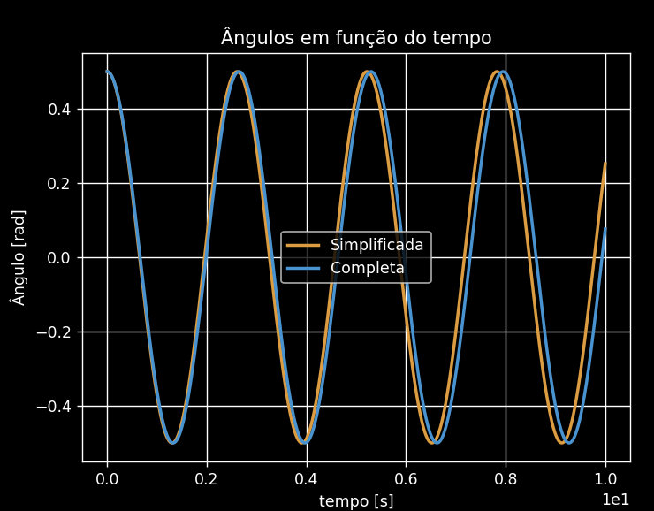
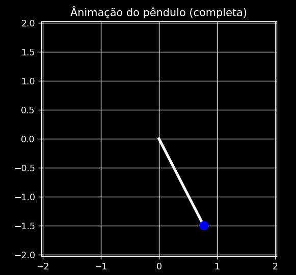
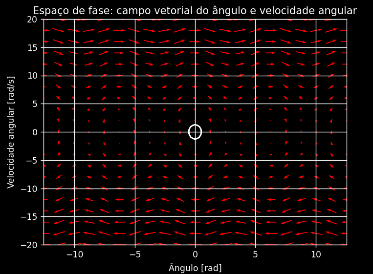
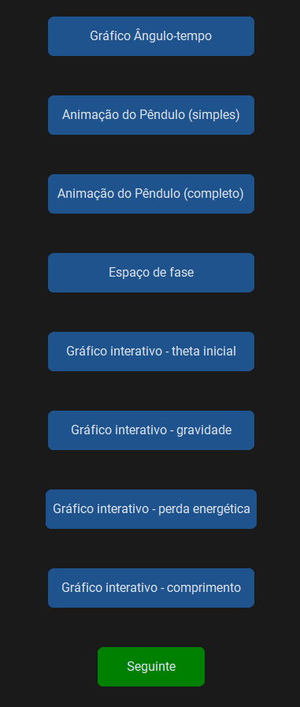

# Pendulum Simulation

This repository provides a graphical and interactive simulation of a pendulum using Python, employing libraries such as `customtkinter`, `PIL`, and `matplotlib`. The simulation includes animations, interactive graphs, and phase space plots to demonstrate pendulum motion and the impact of various parameters.

Note: some of the code and GUI is in Portuguese

## Features

1. **Simple and Full Pendulum Simulations**: Includes animations of both simplified and complete pendulum equations.
2. **Graphs of Angle vs. Time**: Displays plots for both simplified and complete models of pendulum motion.
3. **Phase Space Plot**: Shows angular velocity as a function of angle.
4. **Interactive Parameter Adjustments**: Use sliders to adjust parameters (initial angle, gravity, energy loss coefficient, string length) and view their impact in real-time.

## Requirements

To run this simulation, ensure you have the following libraries installed:

- `customtkinter`
- `PIL`
- `matplotlib`
- `plotly`
- `scipy`
- `numpy`

